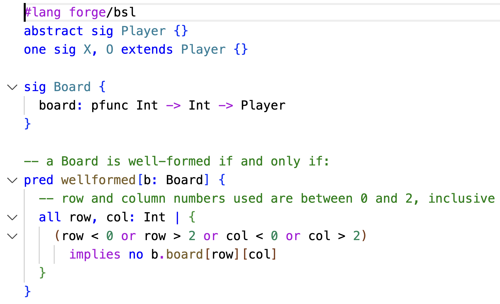
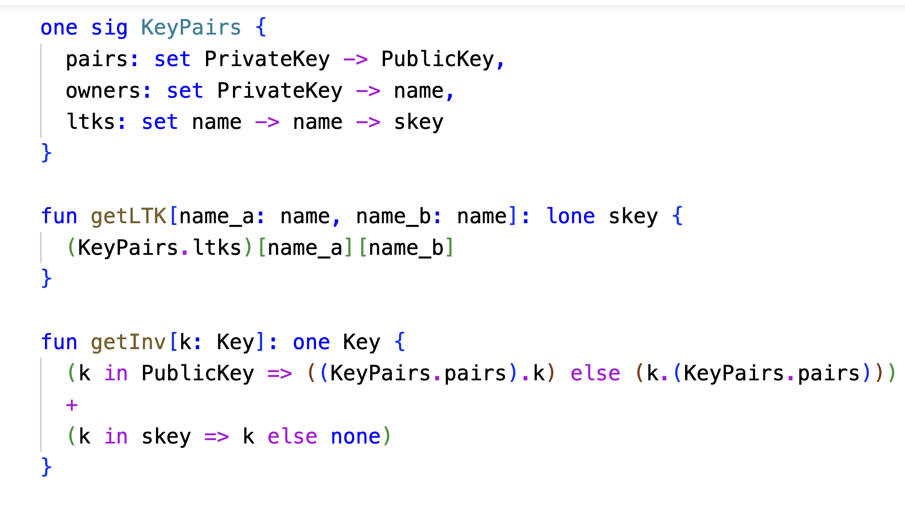
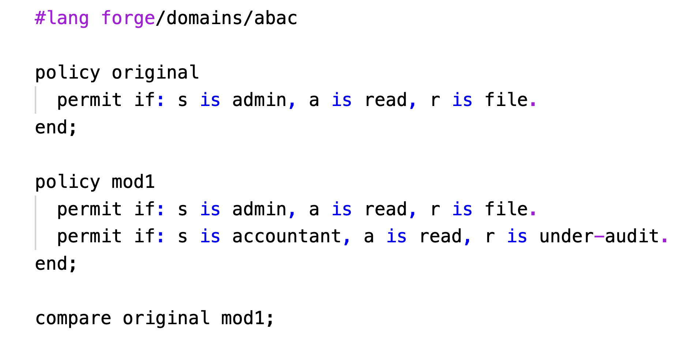
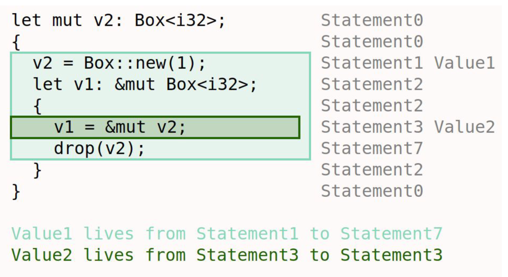
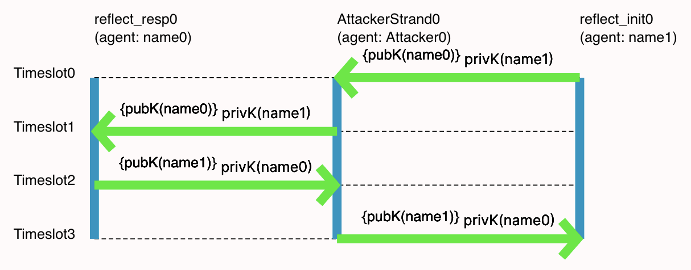
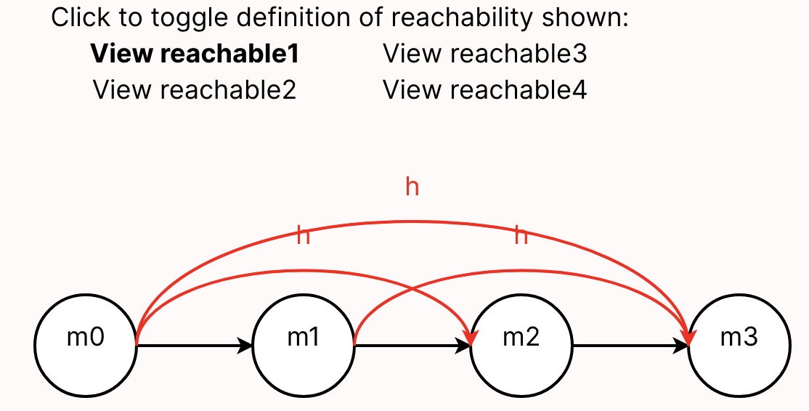

# A Tool and Language for Teaching Formal Methods

Forge is a lightweight formal-methods tool, similar to [Alloy 6](https://alloytools.org), built with *teaching* in mind. Forge provides a progression of sub-languages that gradually build in expressive power to match students' experience and expertise. 

## Forge is for everyone...

  

 
  

    
from beginners...

  

  

 
  

    
to domain experts...

  

  

 
  

    
to domain-specific language authors.

  

## Forge has...

### Modern Editor Integration

Edit Forge in your favorite text editor; we have added support in both [Visual Studio Code](https://github.com/csci1710/forge-language-extension-vscode/releases) and DrRacket. 

### Domain-Specific Visualization Support

Forge uses the [Sterling](https://sterling-js.github.io) visualizer to enable custom visualizations by _both students and instructors_.

  

  

    
Rust Lifetimes and Borrowing

    
Thomas Castleman and Ria Rajesh

    
(class project)

  

  

  

    
Cryptographic Protocols

    
Abigail Siegel and Mia Santomauro

    
<a href="https://cs.brown.edu/~tbn/publications/ssdnk-fest21-forge.pdf">(link to paper)</a>

  

  

  

    
Network Reachability

    
Tim Nelson and Pamela Zave

    
<a href="https://fm.csl.sri.com/SSFT23/">(link to lab)</a>

  

## Getting Started 

To get started with Forge, follow [these instructions](https://csci1710.github.io/forge-documentation/getting-started/installation.html).

Forge was originally created for [CSCI 1710, "Logic for Systems"](https://csci1710.github.io/) at Brown University. The notes and materials are public and free to use. 

Forge is open source and [hosted on Github](http://github.com/tnelson/forge). 

## Contact 

Got questions? Reach out to `Tim_Nelson@brown.edu`. 

## Thanks 

We are grateful for support from the U.S. National Science foundation and Brown University.
