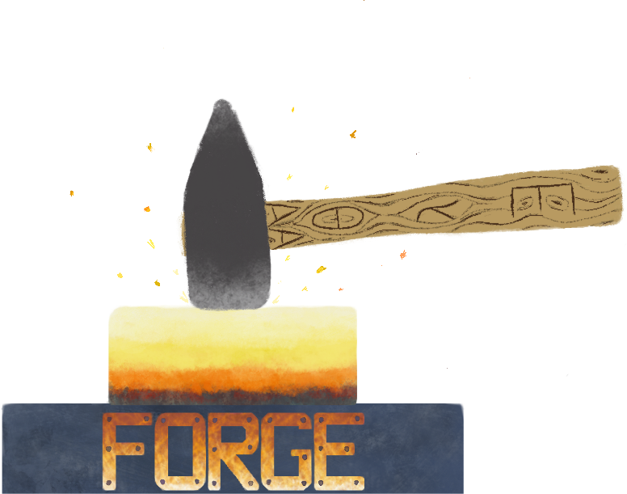

# Forge: A Tool and Language for Teaching Formal Methods

  

 
  

    
Forge is a lightweight formal-methods tool, similar to <a href="https://alloytools.org">Alloy 6</a>, built with <b>teaching</b> in mind. Forge provides a progression of sub-languages that gradually build in expressive power to match students' experience and expertise.   
    <A href="https://forge-fm.github.io/forge-documentation/latest/getting-started/installation/">Installation and Documentation</A>
    

  

<!-- </img> -->

## Forge is for everyone...

  

 
  

    
from beginners...

  

  

 
  

    
to domain experts...

  

  

 
  

    
to domain-specific language authors.

  

## Forge has...

### Modern Editor Integration

Edit Forge in your favorite text editor; we have added support in both Visual Studio Code and DrRacket. 

### Domain-Specific Visualization Support

Forge uses the [Sterling](https://sterling-js.github.io) visualizer to enable custom visualizations by _both students and instructors_.

  

  

    
Rust Lifetimes and Borrowing

    
Thomas Castleman and Ria Rajesh

    
(class project)

  

  

  

    
Cryptographic Protocols

    
Abigail Siegel and Mia Santomauro

    
<a href="https://cs.brown.edu/~tbn/publications/ssdnk-fest21-forge.pdf">(link to paper)</a>

  

  

  

    
Network Reachability

    
Tim Nelson and Pamela Zave

    
<a href="https://fm.csl.sri.com/SSFT23/">(link to lab)</a>

  

## Getting Started 

We suggest that users install via Git, rather than using Racket's package system. Our Github contains release tags that are useful for those who wish to use older versions of the software. Forge now uses [semantic versioning](https://semver.org); major version changes introduce breaking changes.

| Forge Major Version | Textbook Version | VSCode Extension |
| ------------------- | ---------------- | ---------------- |
| **5.0.0 ([docs](https://forge-fm.github.io/forge-documentation/5.0/))** |  [**Spring 2026**](https://forge-fm.github.io/book/2026/) | [forge-fm](https://marketplace.visualstudio.com/items?itemName=SiddharthaPrasad.forge-fm) |
|   4.2.1 ([docs](https://forge-fm.github.io/forge-documentation/4.2/))   |  [Spring 2025](https://forge-fm.github.io/book/2025/)     | [forge-language-server](https://marketplace.visualstudio.com/items?itemName=SiddharthaPrasad.forge-language-server) |

## Materials and Github

Forge was originally created for [CSCI 1710, "Logic for Systems"](https://csci1710.github.io/) at Brown University. The notes and materials (except for recordings, which we cannot release) are public and free to use. A [textbook draft](https://forge-fm.github.io/book/) is also available.

Forge is open source and [hosted on Github](http://github.com/tnelson/forge). 

## Example Models

Beyond the notes and documention, you can find many examples of Forge models in the [`forge/examples` folder](https://github.com/tnelson/Forge/tree/main/forge/examples) of the repository. See the [README](https://github.com/tnelson/Forge/blob/main/forge/examples/README.md) for an itemized list. We are adding to this collection regularly! A selection of these that we use for teaching includes:

### Sample Systems- and Datastructure-Oriented Models

* [Raft leader election](https://github.com/tnelson/Forge/blob/main/forge/examples/raft/leader.frg)
* [Binary Decision Diagrams](https://github.com/tnelson/Forge/blob/main/forge/examples/bdds/bdds.frg)
* [Prim's algorithm](https://github.com/tnelson/Forge/blob/main/forge/examples/prim/prim.frg)
* [Destination-based MAC-layer network forwarding](https://github.com/tnelson/Forge/blob/main/forge/examples/network/network.frg)
* [Basic crypto-protocol domain model](https://github.com/tnelson/Forge/blob/main/forge/domains/crypto/base.frg)

### Sample Mathematically-Oriented Models 

* [Boolean logic](https://github.com/tnelson/Forge/blob/main/forge/examples/basic/booleanLogic.frg)
* [Finite-trace linear temporal logic](https://github.com/tnelson/Forge/blob/main/forge/examples/ltlf/ltl_f.frg)
* [Conway's Game of Life](https://github.com/tnelson/Forge/blob/main/forge/examples/basic/gameOfLife.frg) 

## Our Papers 

To read more about our motivation and design, see our [OOPSLA 2024 paper](https://cs.brown.edu/~tbn/publications/forge-oopsla24.pdf). 

## Contact 

Got questions? Reach out to [`Tim_Nelson@brown.edu`](mailto:Tim_Nelson@brown.edu). 

## Thanks 

We are grateful for support from the U.S. National Science Foundation ([award #2208731](https://www.nsf.gov/awardsearch/showAward?AWD_ID=2208731)) and Brown University.
