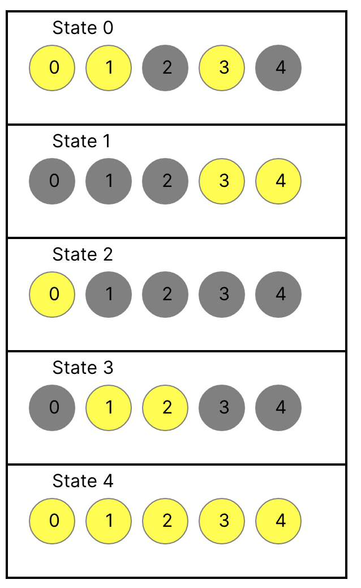

# Example: Solving light-switching puzzles

Many video games contain some variation of a puzzle involving lights and switches. The goal is to get all of the lights lit (or unlit). Usually every light has a corresponding switch, and usually the switch reverses the current state of its light and its immediate neighbors. 

This is an attempt to model a puzzle like that, and includes an example visualization that uses Sterling's script view with temporal mode. See the `lights.js` file for visualizing using Sterling's `instances` variable.

## What It Looks Like

Here's a puzzle trace visualized using this script:

